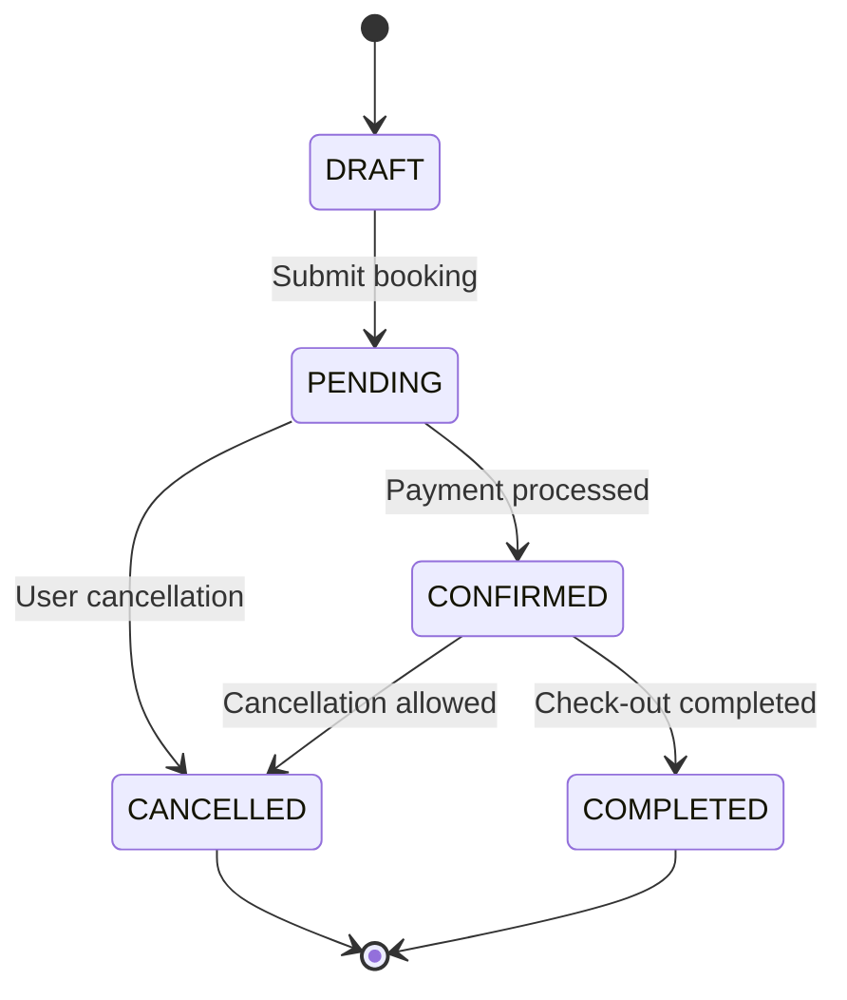

# Booking API Contract

## 📋 Overview

This document defines the API contract between the BFF layer and the Java Spring Boot backend service for booking operations.

## 🔗 Base Configuration

```yaml
Base URL: http://localhost:8080
Content-Type: application/json
Accept: application/json
Timeout: 10 seconds
```

## 📝 Booking Endpoints

### Create Booking

**Endpoint:** `POST /api/bookings`

**Request Body:**
```json
{
  "roomNumber": 101,
  "checkin": "2024-01-15",
  "checkout": "2024-01-17",
  "guestName": "John Doe",
  "guestEmail": "john.doe@example.com",
  "guestPhone": "1234567890",
  "status": "PENDING",
  "createdAt": "2024-01-15T10:30:00.000Z",
  "source": "WEB"
}
```

**Success Response (201 Created):**
```json
{
  "success": true,
  "data": {
    "id": 123,
    "roomNumber": 101,
    "checkin": "2024-01-15",
    "checkout": "2024-01-17",
    "guestName": "John Doe",
    "guestEmail": "john.doe@example.com",
    "guestPhone": "1234567890",
    "status": "CONFIRMED",
    "totalAmount": 299.99,
    "createdAt": "2024-01-15T10:30:00.000Z",
    "updatedAt": "2024-01-15T10:30:00.000Z"
  },
  "message": "Booking created successfully"
}
```

**Error Response (400 Bad Request):**
```json
{
  "success": false,
  "error": {
    "code": "VALIDATION_ERROR",
    "message": "Invalid booking data",
    "details": [
      "Check-in date cannot be in the past",
      "Invalid email format",
      "Room number is required"
    ]
  },
  "timestamp": "2024-01-15T10:30:00.000Z"
}
```

### Get Booking by ID

**Endpoint:** `GET /api/bookings/{id}`

**Path Parameters:**
- `id` (integer): Booking ID

**Success Response (200 OK):**
```json
{
  "success": true,
  "data": {
    "id": 123,
    "roomNumber": 101,
    "checkin": "2024-01-15",
    "checkout": "2024-01-17",
    "guestName": "John Doe",
    "guestEmail": "john.doe@example.com",
    "guestPhone": "1234567890",
    "status": "CONFIRMED",
    "totalAmount": 299.99,
    "createdAt": "2024-01-15T10:30:00.000Z",
    "updatedAt": "2024-01-15T10:30:00.000Z"
  }
}
```

**Error Response (404 Not Found):**
```json
{
  "success": false,
  "error": {
    "code": "BOOKING_NOT_FOUND",
    "message": "Booking not found",
    "details": ["No booking found with ID: 123"]
  },
  "timestamp": "2024-01-15T10:30:00.000Z"
}
```

### Update Booking

**Endpoint:** `PUT /api/bookings/{id}`

**Path Parameters:**
- `id` (integer): Booking ID

**Request Body:**
```json
{
  "roomNumber": 102,
  "checkin": "2024-01-16",
  "checkout": "2024-01-18",
  "guestName": "John Doe",
  "guestEmail": "john.doe@example.com",
  "guestPhone": "1234567890",
  "status": "CONFIRMED"
}
```

**Success Response (200 OK):**
```json
{
  "success": true,
  "data": {
    "id": 123,
    "roomNumber": 102,
    "checkin": "2024-01-16",
    "checkout": "2024-01-18",
    "guestName": "John Doe",
    "guestEmail": "john.doe@example.com",
    "guestPhone": "1234567890",
    "status": "CONFIRMED",
    "totalAmount": 299.99,
    "createdAt": "2024-01-15T10:30:00.000Z",
    "updatedAt": "2024-01-15T11:00:00.000Z"
  },
  "message": "Booking updated successfully"
}
```

### Cancel Booking

**Endpoint:** `DELETE /api/bookings/{id}`

**Path Parameters:**
- `id` (integer): Booking ID

**Success Response (200 OK):**
```json
{
  "success": true,
  "message": "Booking cancelled successfully"
}
```

## 📊 Data Models

### Booking Object
```typescript
interface Booking {
  id: number;                    // Auto-generated booking ID
  roomNumber: number;            // Room number (e.g., 101, 102)
  checkin: string;              // Check-in date (YYYY-MM-DD)
  checkout: string;             // Check-out date (YYYY-MM-DD)
  guestName: string;            // Guest full name
  guestEmail: string;           // Guest email address
  guestPhone?: string;          // Guest phone number (optional)
  status: BookingStatus;        // Booking status
  totalAmount: number;          // Total booking amount
  createdAt: string;            // Creation timestamp (ISO 8601)
  updatedAt: string;            // Last update timestamp (ISO 8601)
  source?: string;              // Booking source (WEB, PHONE, etc.)
}
```

### Booking Status Enum
```typescript
enum BookingStatus {
  DRAFT = "DRAFT",           // Initial state
  PENDING = "PENDING",       // Awaiting confirmation
  CONFIRMED = "CONFIRMED",   // Confirmed booking
  CANCELLED = "CANCELLED",   // Cancelled booking
  COMPLETED = "COMPLETED"    // Completed stay
}
```

## 🔍 Validation Rules

### Required Fields
- `roomNumber`: Must be a positive integer
- `checkin`: Must be valid YYYY-MM-DD format, not in the past
- `checkout`: Must be valid YYYY-MM-DD format, after check-in
- `guestName`: Must be at least 2 characters
- `guestEmail`: Must be valid email format

### Optional Fields
- `guestPhone`: If provided, must be valid phone format
- `status`: Defaults to "PENDING"
- `source`: Defaults to "WEB"

### Business Rules
- Check-in date cannot be in the past
- Check-out date must be after check-in date
- Room number must exist in the system
- Email must be unique per active booking
- Maximum stay duration: 30 days

## 🚨 Error Codes

| Code | HTTP Status | Description |
|------|-------------|-------------|
| `VALIDATION_ERROR` | 400 | Invalid request data |
| `BOOKING_NOT_FOUND` | 404 | Booking ID not found |
| `ROOM_UNAVAILABLE` | 409 | Room not available for dates |
| `DUPLICATE_BOOKING` | 409 | Duplicate booking detected |
| `INVALID_DATE_RANGE` | 400 | Invalid check-in/check-out dates |
| `INTERNAL_ERROR` | 500 | Server-side error |

## 🔄 State Transitions



## 📈 Rate Limiting

- **Requests per minute**: 60
- **Burst limit**: 10 requests per second
- **Headers returned**:
  - `X-RateLimit-Limit`: Request limit
  - `X-RateLimit-Remaining`: Remaining requests
  - `X-RateLimit-Reset`: Reset timestamp

## 🔐 Authentication

Currently using basic HTTP authentication. Future versions may implement:
- JWT tokens
- API key authentication
- OAuth 2.0 integration
