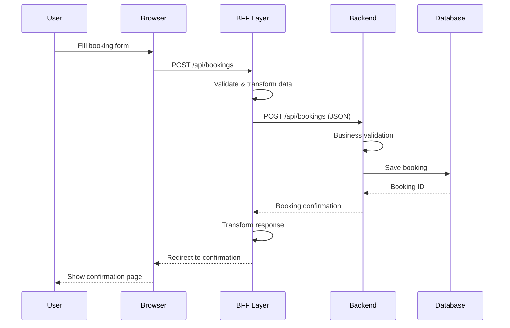
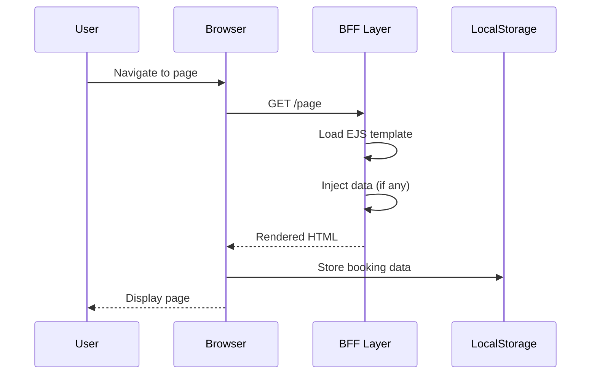
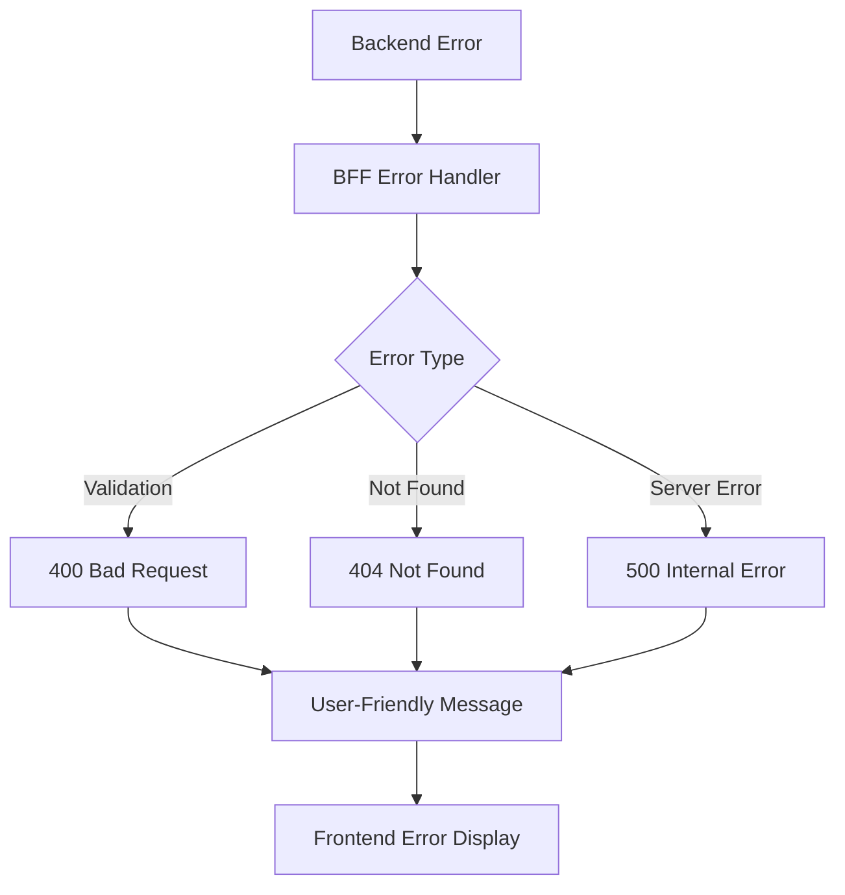

# Data Flow Documentation

## 📊 Data Flow Patterns

### 1. Booking Creation Flow



### 2. Page Rendering Flow



## 🔄 Data Transformation Layers

### Frontend → BFF Transformation
```javascript
// Form data from frontend
{
  roomNumber: "101",
  checkin: "2024-01-15",
  checkout: "2024-01-17",
  guestName: "John Doe",
  guestEmail: "john@example.com"
}

// Transformed by bookingMapper.toBackendDTO()
{
  roomNumber: 101,
  checkin: "2024-01-15",
  checkout: "2024-01-17", 
  guestName: "John Doe",
  guestEmail: "john@example.com",
  status: "PENDING",
  createdAt: "2024-01-15T10:30:00.000Z",
  source: "WEB"
}
```

### BFF → Frontend Transformation
```javascript
// Backend response
{
  id: 123,
  roomNumber: 101,
  checkin: "2024-01-15",
  checkout: "2024-01-17",
  guestName: "John Doe",
  totalAmount: 299.99
}

// Transformed by bookingMapper.toFrontendDTO()
{
  bookingId: 123,
  roomType: "Standard Room 101",
  checkInDate: "2024-01-15",
  checkOutDate: "2024-01-17",
  guestName: "John Doe",
  totalAmount: 299.99,
  numberOfNights: 2
}
```

## 📱 Client-Side Data Flow

### LocalStorage Management
```javascript
// Booking data storage
localStorage.setItem('bookingDetails', JSON.stringify({
  roomType: 'Standard Room',
  price: 149.99,
  checkInDate: '2024-01-15',
  checkOutDate: '2024-01-17',
  guests: 2
}));

// Data retrieval with validation
function getBookingDetails() {
  try {
    const raw = localStorage.getItem('bookingDetails');
    return raw ? JSON.parse(raw) : null;
  } catch (_) { 
    return null; 
  }
}
```

### Form Data Processing
```javascript
// Form submission flow
1. User fills form → FormData
2. JavaScript validation → Validated data
3. AJAX/Fetch request → JSON payload
4. Server response → Updated UI state
5. LocalStorage update → Persistent state
```

## 🗄️ Data Persistence Patterns

### Session Data (Temporary)
- **Storage**: Browser localStorage/sessionStorage
- **Lifetime**: Until browser close or explicit clear
- **Use Cases**: 
  - Booking form data
  - User preferences
  - Navigation state

### Application Data (Persistent)
- **Storage**: Backend database
- **Lifetime**: Permanent (until deleted)
- **Use Cases**:
  - Confirmed bookings
  - Guest information
  - Room availability

## 🔍 Data Validation Flow

### Multi-Layer Validation
```
1. Client-Side (JavaScript)
   ├── Form field validation
   ├── Date range validation
   └── Required field checks

2. BFF Layer (Node.js)
   ├── Data type validation
   ├── Business rule validation
   └── Sanitization

3. Backend Layer (Java)
   ├── Entity validation
   ├── Database constraints
   └── Business logic validation
```

### Date Handling Consistency
```javascript
// Consistent date format: YYYY-MM-DD
const dateUtils = {
  // Frontend: Flatpickr → YYYY-MM-DD
  // BFF: dates.nightsBetween(checkin, checkout)
  // Backend: LocalDate.parse("YYYY-MM-DD")
  
  format: "YYYY-MM-DD",
  timezone: "UTC for calculations",
  display: "Localized formatting"
};
```

## 📊 Error Handling Flow

### Error Propagation


### Error Response Format
```javascript
// Standardized error response
{
  success: false,
  error: {
    code: "VALIDATION_ERROR",
    message: "Invalid booking data",
    details: [
      "Check-in date cannot be in the past",
      "Invalid email format"
    ]
  },
  timestamp: "2024-01-15T10:30:00.000Z"
}
```

## 🔄 State Management

### Booking State Transitions
```
DRAFT → PENDING → CONFIRMED → COMPLETED
   ↓       ↓         ↓          ↓
CANCELLED ← CANCELLED ← CANCELLED
```

### Data Synchronization
- **Client State**: localStorage bookingDetails
- **Server State**: Database booking records
- **Sync Points**: Form submission, page navigation
- **Conflict Resolution**: Server state takes precedence
